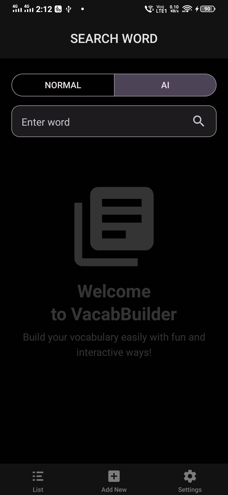
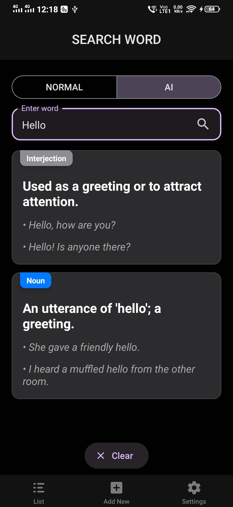
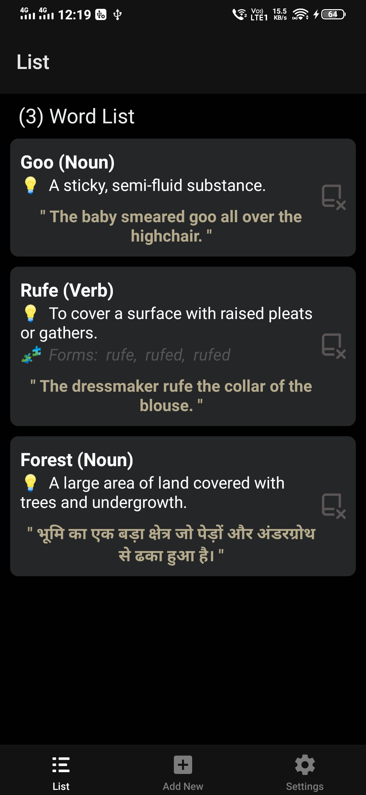
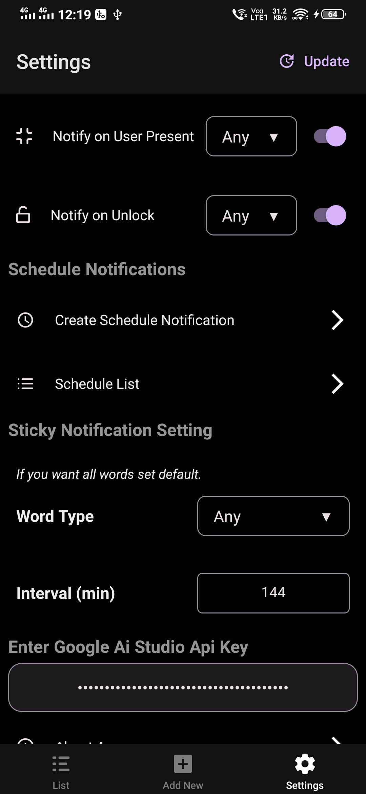
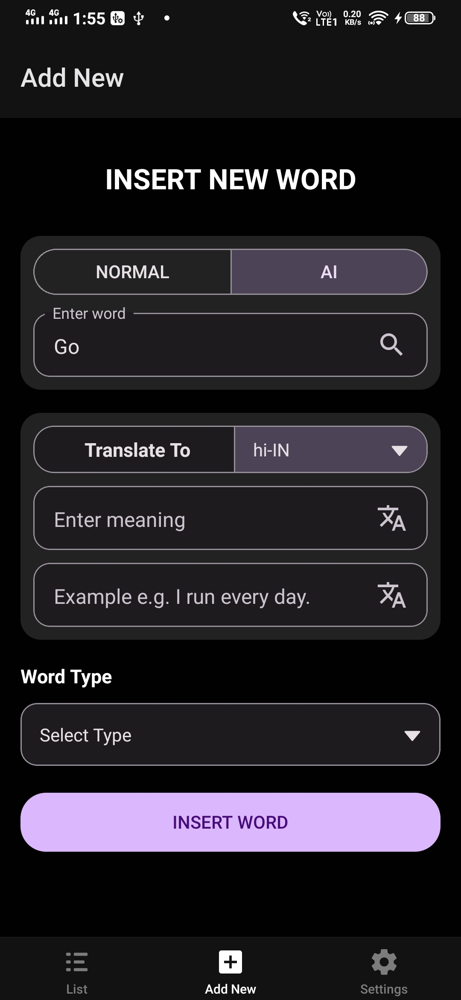
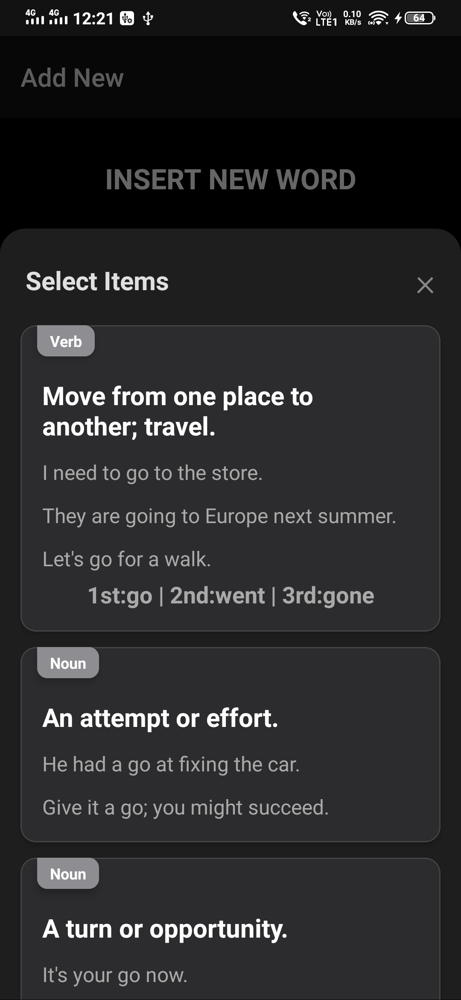

# 📘 Vocabulary Builder

An open-source Android app to help users **search**, **save**, and **memorize English vocabulary**, with support for **AI-generated examples**, **native language definitions**, and **smart notifications** like sticky alerts and unlock/screen-on triggers.


---

## 🚀 Features

### 🔍 1. Powerful Word Search By Dictionary/AI
- Search for any English words using a standard dictionary or leverage the integrated AI (powered by Google's Gemini)
- Get:
  - Definitions
  - Word types (noun, verb, etc.)
  - Verb forms (if applicable)
  - Example sentences

---

### 📚 2. Custom Word Lists
- Save any word into your local Database.
- Create and manage multiple word.
- Insert/delete saved entries easily.

---

### 🔔 3. Smart Notifications
-  Set up notifications at fixed time intervals to review words from your list throughout the day
- **Sticky Notifications**:
  - Persistent on notification bar.
  - Swiping shows new random word from your list.
- **Smart Notifications**:
  - Receive a new vocabulary word every time you unlock your phone or turn on your screen. This feature turns a daily habit into a powerful learning opportunity..

---

### 🌐 4. AI & Dictionary Integration
- Integrates with dictionary APIs and AI (Google Gemini).
- Auto-generate:
  - Translations in your native language
  - Contextual examples
- Save AI-enhanced meanings and examples for each word.
---

## 🤖 AI Integration (Gemini / Google AI Studio)

To enable AI-powered word suggestions, example generation, you'll need to provide your own **Google AI Studio API key**.

### 🔧 How to Set It Up

1. Go to **[Google AI Studio](https://makersuite.google.com/app/apikey)** and generate your **Gemini API Key**.
2. Open the **VocabBuilder** app.
3. Navigate to the **Settings** screen.
4. Paste your API key into the field labeled:  
   🛠️ `"Enter Google AI Studio Api Key"`
5. You're all set! The app will now use Gemini AI to enhance word definitions and examples.

> ⚠️ Make sure your key is kept secure and avoid exceeding free-tier limits.
---

### 💾 5. Offline Support
- Uses SQLite Database for local storage.
- Works offline after word is saved.

---

## 🛠️ Tech Stack

| Component       | Technology                        |
|----------------|------------------------------------|
| Language        | React Native (Expo), Kotlin (Android hooks) |
| Architecture    | MVVM-like using Hooks & Context    |
| DB              | SQLite (via Expo SQLite + Drizzle) |
| UI              | React Native Paper, Custom Styling |
| Networking      | Manual `fetch` API   |
| Notifications   | Custom Notifications API + Triggers |
| AI Integration  | Gemini API / Dictionary API        |
---

## 🖼️ Screenshots

### 📱 Home, Search, Word List

| Home | Search Result | My Word List |
|------|----------------|--------------|
|  |  |  |

---

### ⚙️ Settings, Insert Word, AutoFill

| Setting | Insert Word | Search & AutoFill |
|------|----------------|--------------|
|  |  |  |

---

## 📲 Getting Started

### Clone the repository
```bash
git clone https://github.com/MerajCode/vocabularyBuilder.git
cd vocabularyBuilder
```
### Run
```bash
npx expo run:android
or
npm run start
```
### Build for Android
```bash
npm run build:android
or
npx expo run:android --variant release

```
## 📌 License

This project is licensed under a **custom license** designed to allow open collaboration while protecting the original author's rights.

You are free to:
- View, modify, and use the code for personal or educational purposes
- Contribute improvements via pull requests

You are **not allowed** to:
- Publish, distribute, or re-upload this project (even modified) to any app store or public platform
- Use the original name, branding, or UI/UX for redistribution
- Use the project commercially without permission

Only the original author holds the rights to officially publish or distribute this app.

➡️ See the full [LICENSE](./LICENSE) file for detailed terms.

---

## 🙏 Thanks & Acknowledgements

This app is made possible thanks to the following free and open APIs:

| Feature                    | API Used                                                                                   |
|---------------------------|---------------------------------------------------------------------------------------------|
| 📖 English Dictionary      | [`dictionaryapi.dev`](https://dictionaryapi.dev)                    |
| 🌍 Language Translation    | [`MyMemory Translation API`](https://mymemory.translated.net)                      |
| 🤖 AI Content Generation   | [`Gemini API by Google AI Studio`](https://aistudio.google.com/apikey) |

> We are grateful to these platforms for providing open access to powerful tools for education and language learning.

---

## 🌟 Happy Learning!

We built Vocabulary Builder to make it easier for everyone to grow their vocabulary—whether you're a student, a developer, or a lifelong learner.

> 💬 “A word after a word after a word is power.” — *Margaret Atwood*

If this app helped you, consider ⭐ starring the repo and sharing it with others.

**Keep learning, keep growing! 🚀**

---